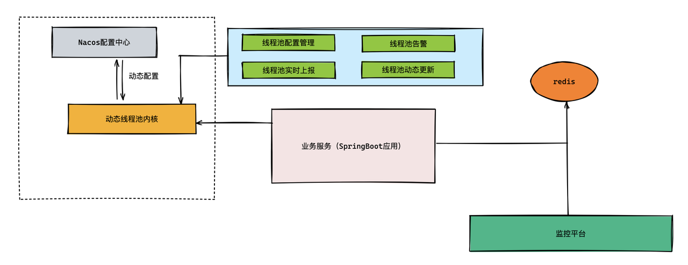
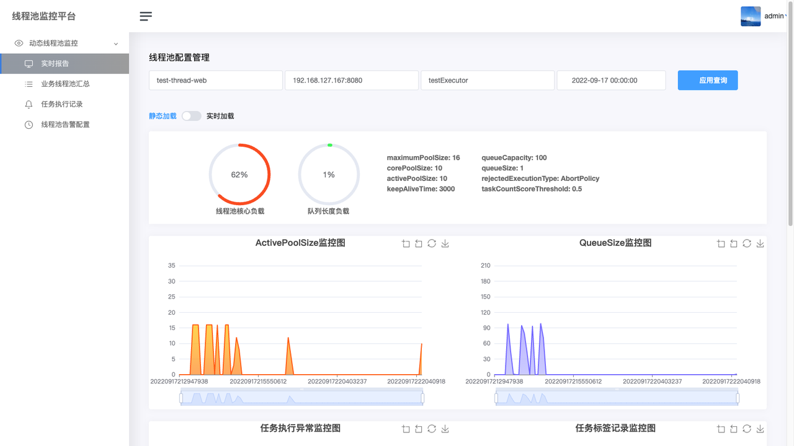
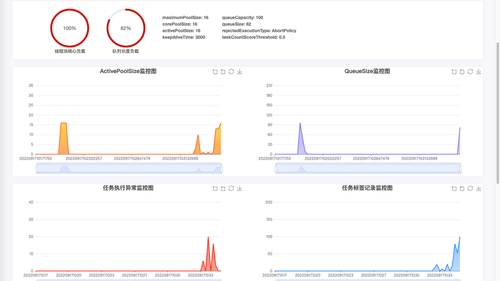
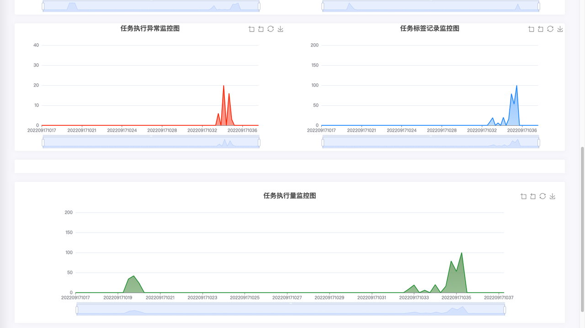
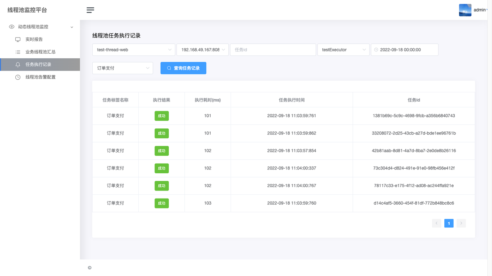
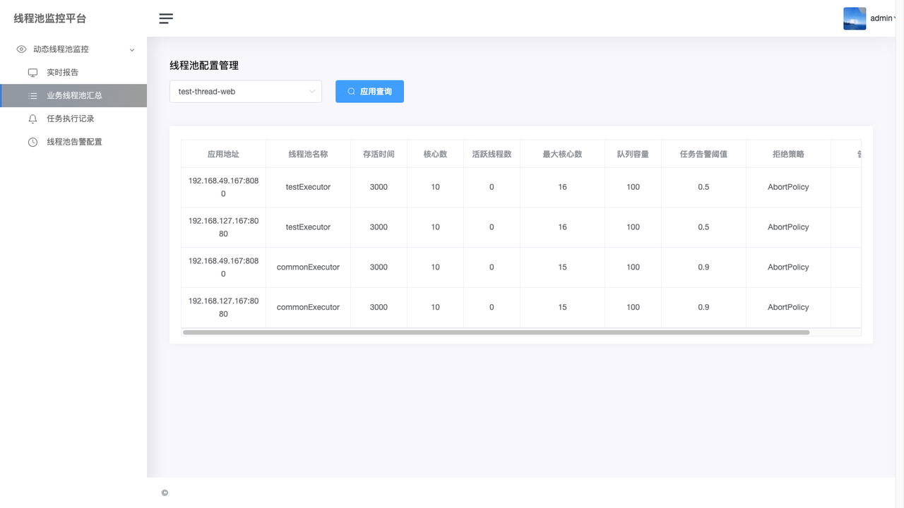
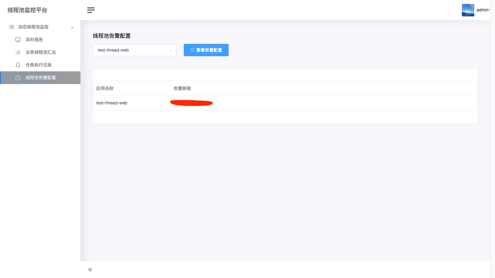

# threadpool-monitor-center

#### 介绍
动态线程池监控平台

#### 软件架构
监控平台架构图如下所示：




#### 安装教程
1.部署一个用于存储线程池数据的redis服务。
2.部署一个用于动态管理线程池配置的nacos服务。
3.修改业务服务的配置，加入下边案例模版1-1类型配置。
4.修改监控平台的配置，加入下边案例模版1-2类型配置。
5.启动业务服务，将线程池数据上报到redis中。
6.启动监控平台，从redis中拉取线程池数据。

#### 使用说明

1.  动态线程池配置模版（1-1类型）

```
//告警邮件地址
dynamic.threadpools.alarmEmails=test@qq.com
//线程池基础属性的配置
dynamic.threadpools.executors.testExecutor.corePoolSize=16
dynamic.threadpools.executors.testExecutor.maximumPoolSize=16
dynamic.threadpools.executors.testExecutor.keepAliveTime=3000
dynamic.threadpools.executors.testExecutor.queueCapacity=100
dynamic.threadpools.executors.testExecutor.rejectedExecutionType=commonReject
//任务队列堆积达到该阈值，则触发报警
dynamic.threadpools.executors.testExecutor.taskCountScoreThreshold=0.5
dynamic.threadpools.executors.testExecutor.preStartAllCoreThreads=true
dynamic.threadpools.executors.testExecutor.preStartCoreThread=true
dynamic.threadpools.executors.testExecutor.allowsCoreThreadTimeOut=5000
dynamic.threadpools.executors.testExecutor.alarmStatus=true
dynamic.threadpools.executors.testExecutor.maxTagRecordSize=5000
dynamic.threadpools.executors.testExecutor.watcher=true


dynamic.threadpools.executors.commonExecutor.corePoolSize=4
dynamic.threadpools.executors.commonExecutor.maximumPoolSize=15
dynamic.threadpools.executors.commonExecutor.keepAliveTime=3000
dynamic.threadpools.executors.commonExecutor.queueCapacity=11
dynamic.threadpools.executors.commonExecutor.rejectedExecutionType=commonReject
dynamic.threadpools.executors.commonExecutor.taskCountScoreThreshold=0.9
dynamic.threadpools.executors.commonExecutor.preStartAllCoreThreads=true
dynamic.threadpools.executors.commonExecutor.preStartCoreThread=true
dynamic.threadpools.executors.commonExecutor.allowsCoreThreadTimeOut=3000
dynamic.threadpools.executors.commonExecutor.alarmStatus=true
dynamic.threadpools.executors.commonExecutor.maxTagRecordSize=5000
dynamic.threadpools.executors.commonExecutor.watcher=true


#缓存模块的配置 用于记录线程池属性需要上传到的服务器位置
cache.redis.index=0
cache.redis.des=local-redis
cache.redis.host=127.0.0.1
cache.redis.port=6379
cache.redis.time-out=5000
cache.redis.max-idle=100
cache.redis.max-wait-millis=3000
cache.redis.min-idle=1
cache.redis.lock.user=true

```

2.修改线程池监控平台配置（1-2类型）

```
//线程池监控拉取数据的redis服务地址
threadpool.store.redis.index=0
threadpool.store.redis.des=local-redis
threadpool.store.redis.host=127.0.0.1
threadpool.store.redis.port=6379
threadpool.store.redis.time-out=5000
threadpool.store.redis.max-idle=100
threadpool.store.redis.max-wait-millis=3000
threadpool.store.redis.min-idle=1
threadpool.store.redis.lock.user=true

//线程池监控管理的服务名称，多个服务的话可以用逗号分隔
threadpool.application.name.list=order-application,goods-application,user-application
//管理台账号密码
console.admin.username=root
console.admin.password=123456

```

#### 监控页面效果截图：

实时监控页面（原始状）


实时监控页面（全屏状-1）


实时监控页面（全屏状-2）


任务标签页面


线程池列表页面



线程池告警配置页面

